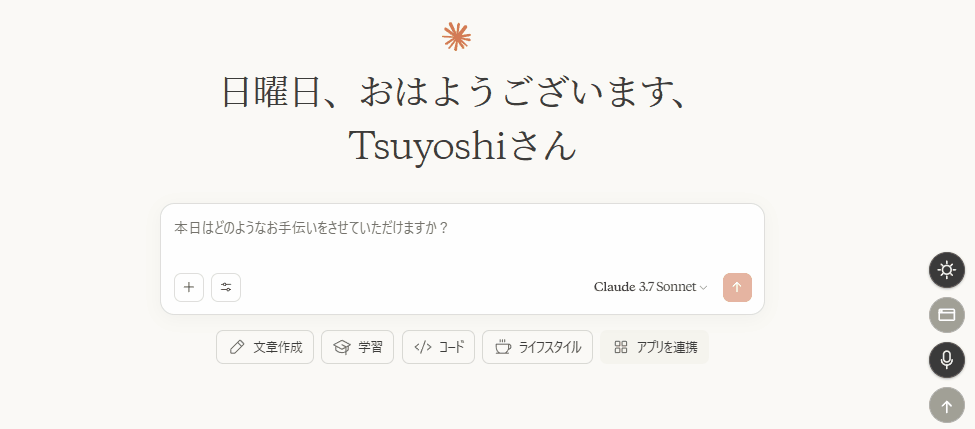

# Chrome用ユニバーサル音声入力拡張機能

otak-voiceは、あらゆるウェブサイトで使えるChrome向け高度な音声入力拡張機能です。

[](https://github.com/tsuyoshi-otake/otak-voice)
[](https://github.com/tsuyoshi-otake/otak-voice/releases/tag/v3.1)
[](https://jestjs.io/)
[](https://snyk.io/)

## 主な機能

- **どこでも使える音声入力**: あらゆるウェブサイトのテキスト入力欄で使用可能
- **gpt-4o-miniによる自動文脈修正**: 音声認識結果を自動的に校正
- **gpt-4.1による高精度校閲**: 入力内容全体を高精度AIモデルで校閲
- **SPA（シングルページアプリケーション）対応**: 画面遷移後も自動的に再初期化
- **追記モード**: 既存のテキストに追記可能
- **自動送信機能**: 音声入力後に自動的に送信ボタンをクリック
- **モーダルウィンドウ表示**: 入力フィールドが見つからない場合やTwitterなどの特定サイトでモーダルウィンドウに結果を表示
- **自動認識ON/OFF**: 設定から音声認識の自動開始を切り替え可能
- **多言語対応**: 日本語、英語、ベトナム語をサポート
- **ダークモード/ライトモード**: テーマ切り替え機能

## 品質保証

otak-voiceは高品質なコードを維持するために以下の取り組みを行っています。

- **自動テスト**: Jestフレームワークを使用した単体テストにより、機能の安定性を確保
- **セキュリティスキャン**: Snykによる継続的なセキュリティ脆弱性チェックを実施
- **コード品質**: モジュール化されたアーキテクチャと明確な責任分離

## 最新リリース

**[v3.1](https://github.com/tsuyoshi-otake/otak-voice/releases/tag/v3.1)** (2025-05-04) - [ダウンロード](https://github.com/tsuyoshi-otake/otak-voice/releases/download/v3.1/otak-voice-v3.1.zip)

- クラウド同期機能の追加設定が複数デバイス間で同期されるようになりました
- テーマ機能の強化ダークモードとライトモードの切り替えが可能になりました
- 音声認識結果表示モーダルの追加入力フィールドが見つからない場合でも音声認識を使用可能に
- x.com (Twitter) サポートの改善複雑なエディタ環境でも使用可能に
- バグ修正「内容を校閲」ボタンのエラーを修正
- パフォーマンス改善DOM操作の最適化によりレスポンス性能が向上

[すべてのリリースを表示](https://github.com/tsuyoshi-otake/otak-voice/releases)

## 使い方

1. 拡張機能のアイコンをクリックしてメニューを開きます
2. マイクボタンをクリックして音声入力を開始します
3. 話し終わると自動的に認識結果がテキスト入力欄に挿入されます
4. 必要に応じて校閲ボタンをクリックし、gpt-4.1で内容を校正できます
5. 設定ボタン（⚙️）からAPIキーや各種設定を変更できます

## UI要素の説明

### メインメニュー

- **マイクボタン** (🎙): 音声認識を開始/停止します
- **追記モードボタン** (+): 既存のテキストに追記するモードを切り替えます
- **クリアボタン** (✕): 現在の入力フィールドの内容をクリアします
- **校閲ボタン** (✓): 現在の入力内容をgpt-4.1で校閲します
- **編集ボタン** (✎): 音声指示による編集モードを開始します
- **設定ボタン** (⚙): 設定モーダルを開きます
- **履歴ボタン** (🕒): 過去の音声入力履歴を表示します
- **テーマ切替ボタン**: ダークモードとライトモードを切り替えます
- **モーダル表示切替ボタン**: モーダルウィンドウ表示のON/OFFを切り替えます
- **自動送信ボタン**: 音声入力後の自動送信機能のON/OFFを切り替えます

### 設定モーダル

設定ボタンをクリックすると表示される設定モーダルでは、以下の設定が可能です。

## 詳細設定

### API設定
- **OpenAI API Key**: OpenAIのAPIキーを設定します。校正・校閲機能を使用するために必要です。

### 表示設定
- **認識言語**: 音声認識に使用する言語を選択します（日本語/英語/ベトナム語）
- **テーマ**: ダークモードまたはライトモードを選択します

### 機能設定
- **入力フィールド自動検出**: ONにすると、ページ内の最適な入力フィールドを自動的に検出します
- **自動校正**: ONにすると、音声認識結果をGPT-4o-miniで自動的に校正します
- **履歴コンテキスト使用**: ONにすると、校正時に過去の入力履歴をコンテキストとして使用します
- **モーダルウィンドウ表示**: ONにすると、入力フィールドが見つからない場合やTwitterなどの特定サイトでモーダルウィンドウに結果を表示します
- **自動送信**: ONにすると、音声入力後に自動的に送信ボタンをクリックします
- **無音検出時間**: 音声認識を自動的に停止する無音時間を設定します（ミリ秒）

### プロンプト設定
- **自動校正プロンプト**: GPT-4o-miniによる自動校正時に使用するプロンプトをカスタマイズできます
- **校閲プロンプト**: GPT-4.1による校閲時に使用するプロンプトをカスタマイズできます

## 特殊機能の使い方

### 追記モード
1. 追記したい入力フィールドをクリックして選択します
2. 追記モードボタン(+)をクリックしてONにします（ボタンが強調表示されます）
3. マイクボタンをクリックして音声入力を開始します
4. 話し終わると、既存のテキストに追記されます

### 校閲機能
1. 校閲したいテキストが入力されている状態で校閲ボタン(✓)をクリックします
2. GPT-4.1による校閲が開始され、結果が入力フィールドに反映されます

### 編集機能
1. 編集したいテキストが入力されている状態で編集ボタン(✎)をクリックします
2. マイクが自動的に有効になり、編集指示を音声で入力できます
3. 例: 「最初の段落を削除して」「もっと簡潔にして」など

### 自動送信機能
1. 自動送信ボタンをクリックしてONにします
2. 音声入力後、自動的に送信ボタンがクリックされます
3. 追記モードがONの場合は、自動送信は行われません

### モーダルウィンドウ表示
1. モーダル表示切替ボタンをクリックしてONにします
2. 入力フィールドが見つからない場合や特定のサイト（Twitter等）では、音声認識結果がモーダルウィンドウに表示されます
3. モーダルウィンドウからテキストをコピーして使用できます

## 注意事項

- OpenAI APIキーが必要です（設定ボタンから設定可能）
- マイクへのアクセス許可が必要です
- 一部のウェブサイト（特にReactやDraft.jsベースの複雑なエディタを使用しているサイト）では、直接入力ができない場合があります。その場合はモーダルウィンドウ表示機能を使用してください。

## プライバシーポリシー

### 1. 処理・保存される情報

otak-voice拡張機能では、以下の情報が処理または保存されます。

- **音声入力テキスト**: 音声認識によって入力されたテキストは、校正・校閲機能を使用する場合にのみOpenAI APIに送信されます
- **ユーザー設定**: 選択した言語設定（日本語/英語/ベトナム語）やテーマなどの設定はChrome同期機能によりクラウドに保存されます
- **OpenAI APIキー**: ユーザーが提供したAPIキーはChrome同期ストレージ (`chrome.storage.sync`) に保存され、OpenAIサービスへの認証に使用されます。これにより、同じGoogleアカウントでログインしている他のデバイスとも同期されます。

### 2. 情報の使用目的

処理・保存される情報は、以下の目的でのみ使用されます。

- **テキスト入力の効率化**: 音声認識を使用してテキスト入力を効率化するため
- **テキスト品質の向上**: OpenAI APIを使用して音声認識結果を校正・校閲するため（ユーザーが機能を使用した場合のみ）
- **ユーザー体験の向上**: ユーザー設定を保存し、デバイス間で同期することでシームレスな体験を提供するため

### 3. 外部サービスとの連携

- **OpenAI API**: 校正・校閲機能を使用する場合のみ、ユーザーが入力したテキストがOpenAI APIに送信されます。この通信はユーザーが明示的に提供したAPIキーを使用して認証されます。

当拡張機能は、上記以外の第三者とユーザーデータを共有することはありません。すべての処理は、ユーザーの明示的な操作（校正・校閲ボタンのクリックなど）によってのみ開始されます。

### 4. 情報の保存

- **音声入力テキスト**: OpenAI APIに送信されたテキストは、APIリクエスト処理後にOpenAIのポリシーに従って処理されます。拡張機能自体はテキストを永続的に保存しません。
- **ユーザー設定**: 言語設定やテーマなどの設定はChrome同期機能によりクラウドに保存され、複数デバイス間で同期されます。
- **OpenAI APIキー**: ユーザーのAPIキーはChrome同期ストレージ (`chrome.storage.sync`) に保存されます。拡張機能の開発者を含む第三者に直接送信されることはありませんが、Chromeの同期機能を通じてGoogleのサーバーに保存される可能性があります。

### 5. ユーザーの権利

ユーザーは以下の権利を有します。

- **アクセス権**: 拡張機能が収集した情報にアクセスする権利
- **削除権**: 拡張機能の設定をリセットし、保存された情報を削除する権利
- **オプトアウト権**: 拡張機能の使用を中止する権利

### 6. セキュリティ

当拡張機能は、ユーザーのOpenAI APIキーを保護するために、以下の措置を講じています。

- APIキーはChrome同期ストレージ (`chrome.storage.sync`) に保存されます。外部の独自サーバーに送信されることはありませんが、Chromeの同期機能によりGoogleのサーバーを経由します。
- APIキーはOpenAI APIへのリクエストにのみ使用されます

### 7. プライバシーポリシーの変更

当プライバシーポリシーは、必要に応じて更新される場合があります。変更があった場合は、このページで通知します。

### 8. お問い合わせ

プライバシーに関するご質問やご懸念がある場合は、以下の方法でお問い合わせください。

- GitHub Issueを通じて: [https://github.com/tsuyoshi-otake/otak-voice/issues](https://github.com/tsuyoshi-otake/otak-voice/issues)

最終更新日: 2025年5月4日

## 開発者向け情報

### 開発環境のセットアップ

1. リポジトリをクローン
   ```
   git clone https://github.com/tsuyoshi-otake/otak-voice.git
   cd otak-voice
   ```

2. 依存関係のインストール
   ```
   npm install
   ```

### テストの実行

Jestを使用して単体テストを実行できます。

```
npm test                # すべてのテストを実行
npm run test:watch      # 変更を監視しながらテストを実行
npm run test:coverage   # カバレッジレポート付きでテストを実行
```

### ビルド

拡張機能をビルドするには

```
npm run build
```

ビルドされたファイルは `dist` ディレクトリに出力されます。

### セキュリティスキャン

このプロジェクトはSnykを使用してセキュリティ脆弱性をスキャンしています。VS Code拡張機能「Snyk Security」を使用すると、ローカル環境でもセキュリティスキャンを実行できます。